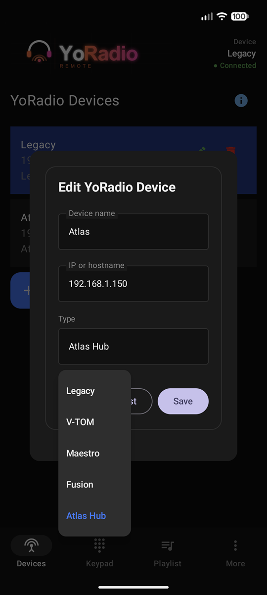
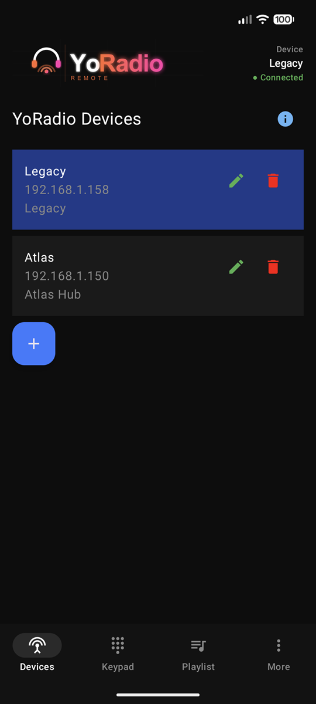
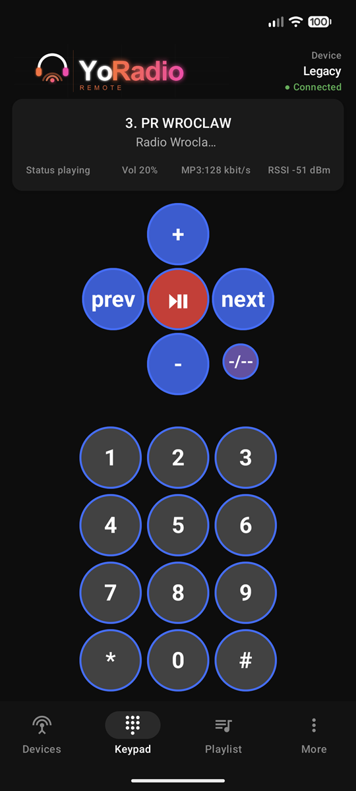
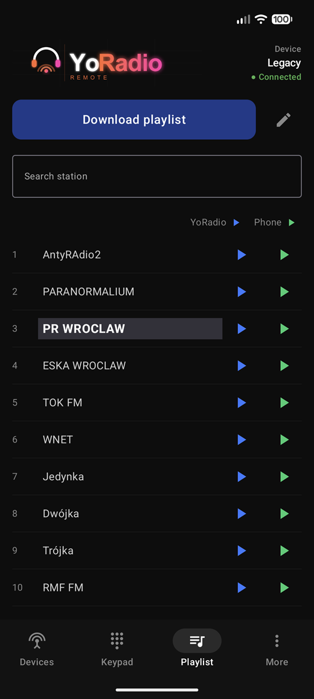
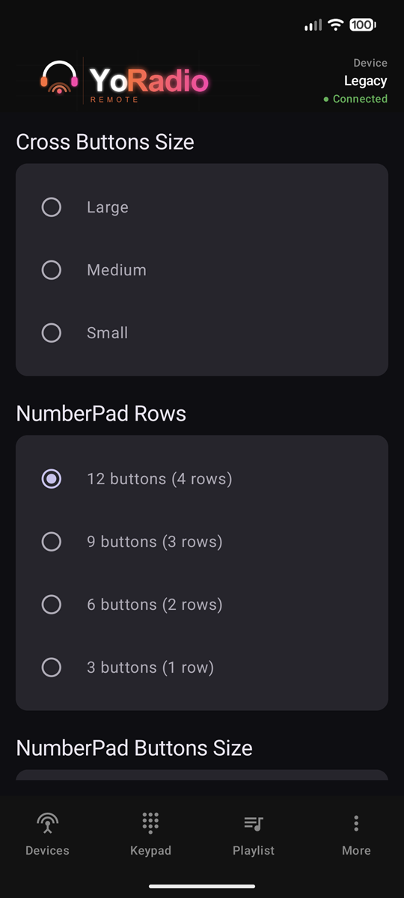
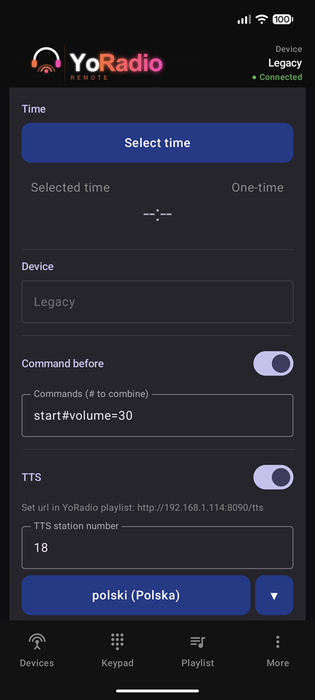
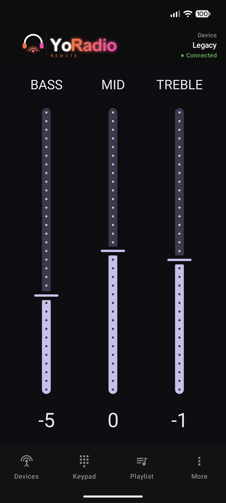

# 📻 YoRadio Remote

  **YoRadio Remote** is an Android companion app for [yoRadio](https://github.com/e2002/yoradio) —
  the ESP32-based internet radio firmware by **e2002**. It discovers yoRadio devices on
  your local network and gives you full control from your phone: stations, volume,
  equalizer, alarms with text-to-speech, and more. When no device is selected, the
  app can also stream stations directly on the phone.

  > Independent companion app — not affiliated with the yoRadio firmware project.

  ## 🚀 Get the App

  Available on Google Play:
  **https://play.google.com/store/apps/details?id=com.yoradio.remote**

  <!-- SCREENSHOT: hero / main remote screen -->

  ## ✨ Features

  ### Remote control
  - 📡 Auto-discovery of yoRadio devices via **mDNS**, or add a device manually by IP
  - 🔌 Manage **multiple yoRadio devices** and switch between them
  - 🎛️Real-time state via **WebSocket** (station, song title, volume, bitrate, Wi-Fi RSSI)
  - 🎚️Send commands over HTTP — transport, volume, mute, sleep, custom commands
  - 🔉 **Hardware volume keys** control the remote device when phone playback is idle

  ### Stations & audio
  - 🎵 Browse the device playlist, switch stations instantly, see what's playing
  - 🎛️**Equalizer** controls (on supported yoRadio builds)
  - 📱 **Phone playback mode** — stream any station directly on the phone (ExoPlayer)
    with a MediaSession notification and lock-screen controls

  ### Alarms & TTS
  - ⏰ Schedule wake-up commands; exact alarms and persistence across reboots
  - 🗣️Optional **Text-to-Speech** announcement at alarm time
    - Uses your Android TTS engine (language follows system settings)
    - The phone hosts the synthesized audio on a small local HTTP server so the
      yoRadio device can fetch and play it on its speakers

  ### Reliability & diagnostics
  - 🔄 Automatic WebSocket reconnect and connection-state indication
  - 🧾 Built-in log viewer for troubleshooting
  - ⬆️ In-app update prompts via Google Play

  ## 📱 Screenshots

  
  

  
  

  
  

  

  <!-- SCREENSHOT: Devices screen — discovered yoRadio units -->
  <!-- SCREENSHOT: Keypad / main remote screen -->
  <!-- SCREENSHOT: Playlist screen -->
  <!-- SCREENSHOT: Equalizer screen -->
  <!-- SCREENSHOT: Alarms screen with a scheduled alarm -->
  <!-- SCREENSHOT: Phone playback notification on the lock screen (optional) -->

  ## ⚙️ Requirements

  - Android **8.0 (API 26)** or newer
  - A yoRadio device reachable on the **same Wi-Fi network**
  - For TTS alarms: a Text-to-Speech engine on the phone (most devices include one)

## 🧭 How to use                                                                                                                                           
                                                                                                                                                             
  The app is organised around a bottom navigation bar with four tabs —                                                                                       
  **Devices**, **Keypad**, **Playlist**, **More** — plus extra screens                                                                                       
  (Equalizer, Alarms, TTS, Commands, mDNS, Settings, Logs) reachable from
  **More**.

  > Make sure your phone and the yoRadio device are connected to the **same
  > Wi-Fi network** before you start.

  ---

  ### 1. Add your first yoRadio device

  Open the **Devices** tab. The first time you launch the app the list is
  empty.

  You have two ways to add a device:

  **a) Discover automatically (recommended)**
  Go to **More → mDNS discovery**. The app scans the local network and lists
  yoRadio devices it finds. Tap one to add it.

  <!-- SCREENSHOT: More menu with the mDNS discovery tile highlighted -->
  <!-- SCREENSHOT: mDNS discovery screen showing a found device -->

  **b) Add manually**
  On the **Devices** tab tap the blue **＋** floating button. Enter:
  - **Name** — any label, e.g. *Kitchen radio*
  - **Host / IP** — the device's IP on the LAN (e.g. `192.168.1.42`)
  - **Type / Version** — the firmware variant your yoRadio runs
  - Use **Test connection** to verify the address before saving.

  <!-- SCREENSHOT: Devices tab with the Add Device dialog open -->

  ### 2. Select the active device

  Tap a device card on the **Devices** tab — its background turns blue to
  indicate it is active. From now on the **Keypad**, **Playlist**, and
  **Equalizer** screens control this device.

  You can rename a device with the ✏️ icon, remove it with 🗑, and open the
  **Logs** view from the ℹ️ button in the top bar to inspect connection
  events.

  <!-- SCREENSHOT: Devices tab with one device selected (highlighted) -->

  ### 3. Control playback — Keypad

  The **Keypad** tab is your main remote. From here you can:
  - See the **currently playing station** and song title
  - Adjust **volume** and **mute**
  - Switch to the **next / previous** station
  - Send **custom commands** to the device

  > Tip: when no station is playing on the phone, your phone's **hardware
  > volume buttons** also control the remote yoRadio's volume.

  <!-- SCREENSHOT: Keypad screen showing current station and controls -->

  ### 4. Browse and switch stations — Playlist

  The **Playlist** tab lists all stations stored on the selected yoRadio.
  Tap a station to start playing it on the device. The currently playing
  station is highlighted.

  <!-- SCREENSHOT: Playlist screen with the active station highlighted -->

  ### 5. Tweak the sound — Equalizer

  Open **More → Equalizer** to adjust bass / middle / treble on supported
  yoRadio firmware builds.

  <!-- SCREENSHOT: Equalizer screen -->

  ### 6. Schedule wake-up alarms

  Open **More → Alarms** (a red badge shows how many upcoming alarms you
  have). Add a new alarm and set:
  - **Time** and repeat days
  - **Command** to execute on the yoRadio (e.g. *play station N*)
  - *(Optional)* a **TTS message** — spoken text the device will play before
    the command (e.g. *"Good morning, it's seven o'clock"*)

  Alarms persist after a phone reboot. For best reliability, exclude the app
  from battery optimisations in Android settings.

  <!-- SCREENSHOT: Alarms list with at least one scheduled alarm -->
  <!-- SCREENSHOT: Add/Edit alarm dialog -->

  ### 7. Set up Text-to-Speech

  Open **More → TTS** to choose the language / voice and test playback.
  TTS uses the engine installed on your phone; if a language is missing,
  install it via your Android system **Text-to-speech** settings.

  <!-- SCREENSHOT: TTS screen with language selection -->

  ### 8. Stream a station on the phone

  You can also play a station **directly on the phone** (handy when you're
  away from your yoRadio):

  - Start playback from the **Playlist** while no remote device is
    controlling audio.
  - A media notification appears with play / pause controls and shows on
    the lock screen.
  - Stop playback to free your hardware volume buttons for remote control
    again.

  <!-- SCREENSHOT: Lock-screen / notification with phone playback controls -->

  ### 9. Custom commands and diagnostics

  - **More → Commands list** — full list of commands you can send to the
    device, useful as a reference.
  - **More → Settings** — app preferences.
  - **Logs** (ℹ️ on the Devices tab) — live log of connection events,
    WebSocket messages, and errors. Handy if something doesn't work.

  <!-- SCREENSHOT: Commands list screen -->
  <!-- SCREENSHOT: Logs view -->

  ### 10. Troubleshooting

  - **Device not found by mDNS** — check that both phone and yoRadio are on
    the same Wi-Fi (some routers isolate guest networks). You can always
    add the device manually by IP.
  - **Status doesn't update** — the app uses a WebSocket; if the connection
    drops it reconnects automatically. Check the **Logs** view for details.
  - **Alarm didn't fire** — disable battery optimisation for the app and
    confirm exact-alarm permission is granted (Android 12+).
  - **TTS sounds wrong / silent** — verify the language is installed in
    Android **Text-to-speech** settings; some engines don't support every
    locale even if listed.

  ## 🔐 Permissions

  The app uses only the permissions it needs:

  | Permission | Why |
  | --- | --- |
  | `INTERNET`, `ACCESS_NETWORK_STATE` | Talk to yoRadio devices and stream audio |
  | `FOREGROUND_SERVICE` (+ `MEDIA_PLAYBACK`), `POST_NOTIFICATIONS` | Phone playback notification and alarm execution |
  | `SCHEDULE_EXACT_ALARM`, `RECEIVE_BOOT_COMPLETED` | Deliver alarms on time and re-arm them after reboot |

  ## 🔐 Privacy

  The app does not collect personal data, contains no analytics or ads, and does
  not send anything to the developer. See the full Privacy Policy:
  **https://sites.google.com/view/yoradioremote/strona-główna**

  ## 📌 Notes & known limitations

  - TTS language availability depends on the engine installed on your device.
    `TextToSpeech.availableLanguages` may report locales that aren't fully usable.
  - Alarm timing and background behavior are subject to Android's battery and
    background-execution restrictions, especially on newer Android versions and
    on heavily customized vendor ROMs (e.g. battery optimizations should be
    disabled for reliable alarms).
  - Some equalizer / command features require recent yoRadio firmware.

  ## 🤝 Feedback

  The source code is **not publicly available** — the app is distributed only via
  Google Play. Bug reports and feature requests are welcome:

  - Open an [issue](../../issues) in this repository
  - Or contact the developer through the Google Play listing

  ## 🙏 Acknowledgements

  - [yoRadio](https://github.com/e2002/yoradio) by **e2002** — the firmware this app
    was built to control.

  ## 📄 License

  This application is distributed via Google Play. Source code is not publicly
  available; this repository is used for documentation, screenshots, and issue
  tracking only.
